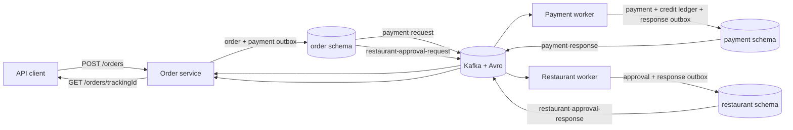

# Enterprise Order Processing Platform

[](https://github.com/ShahriyarSheikh/Enterprise-Order-Processing-Platform/actions/workflows/ci.yml)
[](https://adoptium.net/temurin/releases/?version=17)

An event-driven Java backend for order creation and asynchronous payment and restaurant approval using Kafka, Avro, PostgreSQL, and the transactional outbox pattern.

> **Origin and scope:** this repository is derived from
> [`sogutemir/SpringMicroservice-outbox-kafka-saga-pattern`](https://github.com/sogutemir/SpringMicroservice-outbox-kafka-saga-pattern).
> The upstream project supplied the core service decomposition, domain model, saga flow, Kafka/Avro messaging,
> and initial outbox implementation. This fork preserves the Git history and contributor records and adds build
> automation, focused tests, Flyway migrations, health checks, OpenAPI documentation, and local container
> orchestration. See [NOTICE.md](NOTICE.md) for provenance and the important licensing caveat.

This repository provides a local reference implementation and is not a deployed production system. The sections below deliberately distinguish implemented behavior from planned work.

## What is implemented

- `POST /orders` creates an order and a payment outbox record in one database transaction.
- `GET /orders/{trackingId}` returns the order's current saga-driven status.
- The order service orchestrates payment and restaurant approval through four Kafka topics.
- The payment worker debits or credits a **simulated internal credit ledger**. It does not integrate with a payment provider and must not be described as secure payment processing.
- The restaurant worker checks the seeded restaurant/product read model and returns an approval or rejection.
- Order, payment, and restaurant messaging use database outbox records and asynchronous publishers.
- Kafka payloads use Avro with Confluent Schema Registry.
- PostgreSQL schemas and demo data are managed by versioned Flyway migrations.
- All four applications expose restricted Spring Boot Actuator health/info endpoints; the order service also exposes OpenAPI and Swagger UI.
- Focused tests cover saga success, failure, compensation, duplicate responses, outbox state transitions, mapper round trips, request validation, and PostgreSQL-backed duplicate payment handling.

There are no customer-management, payment, restaurant-management, update-order, delete-order, or notification REST APIs in this codebase.

## Architecture



The successful path is:

1. The order service validates the customer, restaurant, product, price, and order totals, persists a `PENDING` order, and writes a payment outbox record.
2. A scheduler publishes `payment-request`; the payment worker updates its internal credit ledger and writes a response outbox record.
3. A successful `payment-response` changes the order to `PAID` and creates a restaurant-approval outbox record.
4. The restaurant worker validates availability and publishes its decision.
5. Approval completes the saga with `APPROVED`. Rejection starts payment compensation and ends with `CANCELLED` after compensation succeeds. A failed initial payment cancels the order directly.

| Application | Port | Actual responsibility | Business interface |
| --- | ---: | --- | --- |
| Order service | 8181 | Create/track orders and orchestrate the saga | REST and Kafka |
| Payment service | 8182 | Consume payment requests, mutate the demo credit ledger, publish results/compensation results | Kafka only |
| Restaurant service | 8183 | Consume approval requests and check restaurant/product availability | Kafka only |
| Customer service | 8184 | Own and seed customer reference data for the demo | No business API |

The services are split into domain, application, data-access, messaging, and runnable-container modules following ports-and-adapters/hexagonal boundaries. Shared infrastructure modules provide saga, outbox, Kafka producer/consumer, configuration, and Avro model support.

### Reliability boundaries

This implementation provides a useful outbox/saga demonstration, but it does **not** provide exactly-once processing:

- A new outbox row starts as `STARTED`; a Kafka send callback records `COMPLETED` or `FAILED`.
- The application schedulers select `STARTED` rows only. A row marked `FAILED` has no automatic application-level retry or operational replay path.
- Duplicate saga responses are ignored when the expected in-progress outbox state no longer exists. Payment handling also reuses a completed stored response, and database uniqueness constraints prevent some repeated effects.
- The PostgreSQL duplicate test proves rollback for a replay while the first payment outbox row is still `STARTED`. Because the unique key includes `outbox_status`, a replay after that row becomes `FAILED` is not protected and can repeat payment/credit work.
- Completed outbox records are cleaned up, so this duplicate protection is bounded by retained state; it is not permanent message deduplication.

Kafka producer retries still apply before a send is marked failed. Production use would require an explicit retry/backoff policy, dead-letter handling, alerting, and a safe replay procedure.

### Data ownership caveat

The local topology uses one PostgreSQL instance with separate `customer`, `order`, `payment`, and `restaurant` schemas. The order service reads customer and restaurant materialized views across schemas. That is convenient for this demo, but it is tighter coupling than independently owned service databases.

## Technology stack

| Area | Technology |
| --- | --- |
| Runtime | Java 17, Spring Boot 2.6.3 |
| Persistence | Spring Data JPA, PostgreSQL 14, Flyway |
| Messaging | Apache Kafka, Spring Kafka, Apache Avro, Confluent Schema Registry |
| Architecture | Domain-driven modules, ports and adapters, saga orchestration, transactional outbox |
| API/operations | Spring MVC, Bean Validation, springdoc-openapi, Spring Boot Actuator |
| Tests | JUnit 5, Mockito, Spring Boot Test, Testcontainers PostgreSQL |
| Delivery | Maven Wrapper, GitHub Actions, Docker, Docker Compose |

## Run the complete local demo

Prerequisites:

- Docker with a recent Docker Compose v2 release
- Git
- Internet access on the first run to download container images and Maven dependencies

Clone the repository:

```bash
git clone https://github.com/ShahriyarSheikh/Enterprise-Order-Processing-Platform.git
cd Enterprise-Order-Processing-Platform
```

From the repository root, this starts the infrastructure and all four applications, waits for their health checks, creates an order priced at 50.00 using seeded IDs, and polls until the saga reaches `APPROVED`.

Linux/macOS/Git Bash:

```bash
docker compose up --build --wait && sh ./scripts/smoke-test.sh
```

PowerShell:

```powershell
docker compose up --build --wait; if ($LASTEXITCODE -eq 0) { .\scripts\smoke-test.ps1 }
```

The Compose setup binds host ports to `127.0.0.1`, uses a local-development database password, creates the four Kafka topics, runs Flyway on application startup, and runs application containers as a non-root user. It is not a production deployment configuration.

Useful follow-up commands:

```bash
docker compose ps
docker compose logs -f order-service payment-service restaurant-service
docker compose down
```

The seeded customer starts with a 500.00 ledger balance and each smoke test debits 50.00. The eleventh successful-path run will therefore fail payment unless earlier orders were compensated. To remove all local database state and reseed from scratch:

```bash
docker compose down -v
```

`down -v` permanently deletes the Compose-managed PostgreSQL volume.

### Verification status

Verification snapshot (2026-09-11): the full 36-module `clean verify` reactor passed in a Temurin Java 17 Maven container. Docker Desktop 29 initially rejected Testcontainers' legacy Docker API default, so that full run skipped the Docker-dependent test; after pinning docker-java API 1.44 in the test resources, the focused PostgreSQL integration test passed with no skip. The collected Surefire reports contain 27 passing tests with no failures, errors, or skips. A clean Compose build then started all four applications plus PostgreSQL, Kafka, ZooKeeper, and Schema Registry; every application health endpoint returned `UP`, all four Flyway schemas reached version 2, Swagger UI returned HTTP 200, the OpenAPI document exposed the two implemented paths, and the smoke test observed `PENDING` -> `PAID` -> `APPROVED`. Consult the workflow badge and Actions history for current remote CI status.

## API

The order service exposes exactly two business endpoints. Both responses use `application/vnd.api.v1+json`.

| Method | Path | Behavior |
| --- | --- | --- |
| `POST` | `/orders` | Validate and create an order; returns immediately with the initial status |
| `GET` | `/orders/{trackingId}` | Return the current status and any failure messages by tracking UUID |

### Create an order

The following IDs and prices are inserted by the Flyway demo migrations:

```bash
curl --request POST 'http://localhost:8181/orders' \
  --header 'Accept: application/vnd.api.v1+json' \
  --header 'Content-Type: application/json' \
  --data '{
    "customerId": "d215b5f8-0249-4dc5-89a3-51fd148cfb41",
    "restaurantId": "d215b5f8-0249-4dc5-89a3-51fd148cfb45",
    "address": {
      "street": "Alexanderplatz 1",
      "postalCode": "10178",
      "city": "Berlin"
    },
    "price": 50.00,
    "items": [
      {
        "productId": "d215b5f8-0249-4dc5-89a3-51fd148cfb48",
        "quantity": 1,
        "price": 50.00,
        "subTotal": 50.00
      }
    ]
  }'
```

The immediate response has this shape:

```json
{
  "orderTrackingId": "generated-uuid",
  "orderStatus": "PENDING",
  "message": "Order created successfully"
}
```

### Track the saga

Replace the path value with `orderTrackingId` from the create response:

```bash
curl --header 'Accept: application/vnd.api.v1+json' \
  'http://localhost:8181/orders/generated-uuid'
```

A successful demo eventually returns:

```json
{
  "orderTrackingId": "generated-uuid",
  "orderStatus": "APPROVED",
  "failureMessages": []
}
```

Status changes are asynchronous; intermediate responses can be `PENDING` or `PAID`. Failure/compensation paths can expose `CANCELLING` and `CANCELLED` with failure messages.

## API documentation and health

OpenAPI is intentionally limited to the order service because the other applications have no business controllers:

- Swagger UI: <http://localhost:8181/swagger-ui.html>
- OpenAPI JSON: <http://localhost:8181/v3/api-docs>

Actuator exposes only `health` and `info` over HTTP. Health details are not disclosed.

| Application | Health URL |
| --- | --- |
| Order | <http://localhost:8181/actuator/health> |
| Payment | <http://localhost:8182/actuator/health> |
| Restaurant | <http://localhost:8183/actuator/health> |
| Customer | <http://localhost:8184/actuator/health> |

## Database migrations

Each runnable application ships `src/main/resources/db/migration` scripts. The customer and restaurant migration sets also maintain materialized views in the order schema, reflecting the cross-schema coupling described above. Across the four applications:

- `V1` creates the applicable schema, domain tables/types, indexes, outbox tables, and read models.
- `V2` inserts deterministic demo data where needed.

Flyway runs on application startup, records applied versions, creates missing schemas, and has `clean` disabled. The migrations replace ad-hoc Spring SQL initialization; they do not silently drop an existing database.

The payment migrations are exercised automatically against a real PostgreSQL database by the Testcontainers suite. All four migration sets have also been exercised during the verified Compose smoke run, but the order, restaurant, and customer migrations do not yet have isolated database integration tests. An existing pre-Flyway, non-empty database has no Flyway history and will fail safely because automatic baselining is disabled. For a clean local migration run, reset the Compose volume with `docker compose down -v` and start the stack again.

## Build and test

JDK 17 or newer is required for a host build; compilation targets Java 17, and CI uses Temurin 17. Maven itself does not need to be installed because the repository includes the Maven Wrapper.

Linux/macOS/Git Bash:

```bash
./mvnw clean verify
```

Windows PowerShell:

```powershell
.\mvnw.cmd clean verify
```

The suite includes:

- deterministic Mockito tests for payment and restaurant-approval saga success, failure, and compensation;
- duplicate-response no-op tests and completed-payment response replay tests;
- outbox publish-callback tests for `STARTED` to `COMPLETED`/`FAILED` transitions;
- order/payment/restaurant outbox persistence-mapper round-trip tests, including processed timestamps;
- controller validation tests for malformed UUID input and nested address constraints;
- monetary value-object tests covering scale-insensitive equality and hash-code consistency;
- a Testcontainers PostgreSQL service-layer test that verifies a duplicate payment request is rolled back without repeating credit/payment/outbox effects while the original outbox row is `STARTED`.

`PaymentRequestMessageListenerTest` uses `postgres:14-alpine` and is annotated with `disabledWithoutDocker = true`. It runs when Docker is discoverable and is skipped otherwise. There is not yet a Kafka/Schema Registry Testcontainers or full end-to-end integration test.

## Continuous integration

`.github/workflows/ci.yml` runs on pushes, pull requests, and manual dispatch. It uses Temurin Java 17, caches Maven dependencies, and executes:

```bash
bash ./mvnw --batch-mode --no-transfer-progress clean verify
```

The badge at the top reflects GitHub-hosted workflow runs. It does not cover Docker Compose startup, the smoke test, or deployment.

## Scope and authorship

This repository extends the attributed upstream codebase with GitHub Actions CI, Flyway migrations, Actuator health checks, OpenAPI documentation, Docker Compose orchestration, and focused saga, outbox, and bounded duplicate-handling tests using JUnit, Mockito, and Testcontainers PostgreSQL.

The inherited service design and core saga/outbox implementation remain attributed in [NOTICE.md](NOTICE.md). Current scope excludes secure/external payment processing, exactly-once delivery, customer/restaurant CRUD APIs, production deployment, and comprehensive end-to-end coverage.

## Known limitations and roadmap

The highest-value next improvements are:

1. Upgrade the inherited Spring Boot 2.6.3 baseline to a supported Spring Boot release and migrate `javax` APIs to `jakarta`.
2. Add explicit retry/backoff, dead-letter topics, failed-outbox replay, metrics, and operational alerting.
3. Add Kafka + Schema Registry Testcontainers tests, contract tests, and a repeatable CI end-to-end smoke test.
4. Replace cross-schema materialized-view reads with event-maintained local read models or service APIs and independently owned databases. Until then, refresh the restaurant view when `restaurants` or `products` change, not only when `restaurant_products` changes.
5. Align the inherited order-address database key `(id, order_id)` with the JPA identity model, which currently treats only `id` as the entity identity.
6. Add authentication/authorization, secrets management, rate limiting, and security/dependency scanning.
7. Add metrics, distributed tracing, dashboards, structured correlation IDs, load tests, and failure-injection tests.
8. Provide a real deployment target with infrastructure-as-code and deployment evidence; today the runnable proof is local Compose only.
9. Resolve the upstream licensing ambiguity before copying or redistributing the project.

## Attribution and licensing

The original history and contributors remain visible in Git. The canonical upstream project is
[`sogutemir/SpringMicroservice-outbox-kafka-saga-pattern`](https://github.com/sogutemir/SpringMicroservice-outbox-kafka-saga-pattern).

No license file is present in the inherited repository history or in this repository at the time of writing. [NOTICE.md](NOTICE.md) records provenance but does not grant a license. Obtain clarification from the relevant rights holder before reuse or redistribution beyond permissions provided by law.
